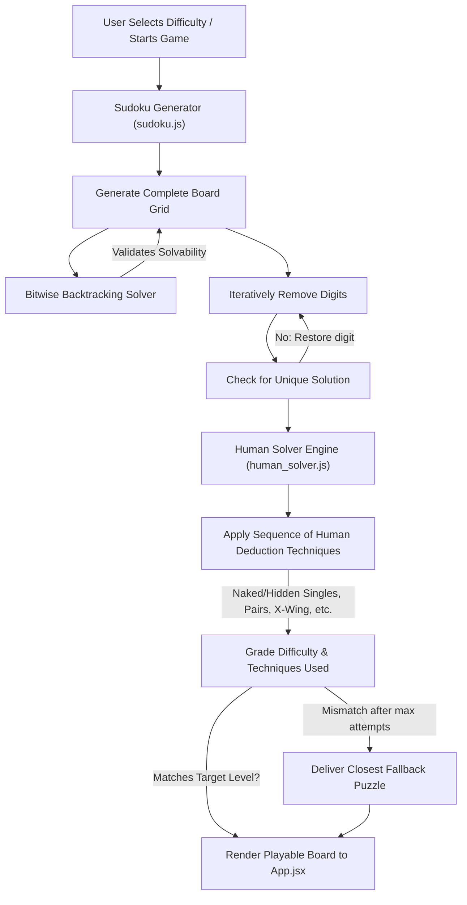
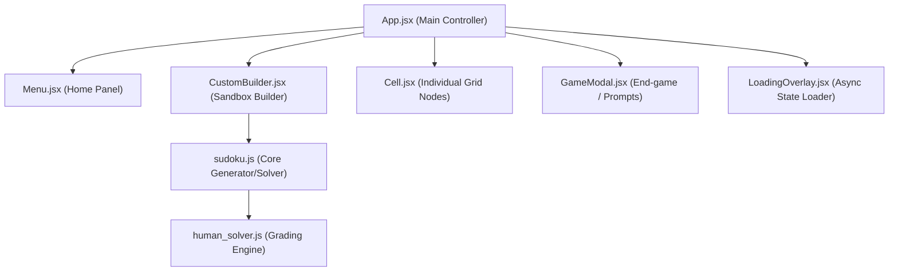

# React Sudoku Engine

A modern Sudoku application built with React 19 and Vite featuring a custom puzzle generator, human-style logical solver, and technique-based difficulty grading.

This application showcases the implementation of a constraint-based backtracking solver optimized with bitwise operations, paired with a sophisticated **rule-based human-like reasoning engine** that parses, grades, and solves puzzles using actual deduction techniques (instead of brute-force).

---

## Why this project?

Most Sudoku applications classify puzzle difficulty using clue count or rely entirely on brute-force search.

This project instead grades puzzles by solving them with a custom human-style deduction engine implementing techniques such as Naked Pairs, Claiming Pairs, Unique Rectangles, and X-Wings.

This allows puzzles with similar clue counts to receive different difficulty ratings based on the logical reasoning actually required.

## 🗺️ System Architecture

The following diagram illustrates how the game flow interacts with the generator, bitwise solver, and human reasoning grading engine:



### Component Hierarchy

The interface features a modular React structure:



---

## ✨ Key Features

- 🎲 **Intelligent Puzzle Generator**: Generates unique-solution boards on-the-fly across six distinct difficulty ratings: *Beginner, Easy, Medium, Hard, Expert, and Extreme*.
- 🧠 **Rule-Based Grading Engine**: Employs human logic deduction heuristics to grade puzzles based on the hardest technique required to solve them.
- 🛠️ **Custom Sudoku Sandbox Builder**: A dedicated utility where users can:
  - Input their own custom Sudoku puzzles (minimum 17 clues enforced).
  - Verify uniqueness and solve the puzzle with one click.
  - Perform real-time conflict checking and complexity analysis.
  - Play the custom board directly inside the game mode.
- ⚡ **Performance Optimized**: Sub-millisecond constraint satisfaction via bitwise board masking.
- 💾 **State Persistence**: Saves current board, notes, timer, and mistakes in real-time to `localStorage`. Page refreshes or accidental exits won't lose game progress.
- ⌨️ **Keyboard Navigation**: Full support for arrow-key navigation, numbers (1-9), Backspace/Delete, and N (toggle pencil notes) for a fluid, power-user experience.
- 🎨 **Polished UX & Design**: Styled with a CSS variable-based design system featuring fluid animations, responsive layouts, pencil mark grids, mistake limits, and visual highlighting of identical values.

---

## ⚙️ Technical Deep Dive

### 1. Bitwise Backtracking Solver (`sudoku.js`)

To verify unique solutions and generate boards at lightning speed, the core solver in [sudoku.js](file:///home/jayed/GitHub/react-sudoku-engine/src/sudoku.js) uses **bitwise mask arrays** (`Int16Array`).

- Instead of repeatedly scanning rows, columns, and 3x3 subgrids using loops (which is **O(N)**), constraints are represented as integers where the *i*-th bit represents the presence of digit *i+1*.

- Finding valid choices for a cell becomes a simple bitwise OR followed by negation and masking:

```text
taken     = rowMasks[r] | colMasks[c] | boxMasks[boxIndex]
available = (~taken) & 0x1FF
```

- The solver incorporates the **Minimum Remaining Values (MRV) heuristic** to find the cell with the fewest candidates first, dramatically reducing backtracking branch count.
### 2. Human Logic Solver & Puzzle Grader (`human_solver.js`)
Instead of backtracking, the solver in [human_solver.js](file:///home/jayed/GitHub/react-sudoku-engine/src/human_solver.js) resolves grids using techniques modeled after human deduction:
- **Tier 1 (Beginner)**: *Full House*, *Hidden Singles (No Pencil Marks)*.
- **Tier 2 (Easy)**: *Naked Singles*.
- **Tier 3 (Medium)**: *Pointing Pairs*.
- **Tier 4 (Hard)**: *Hidden Singles (With Marks)*, *Naked Pairs*, *Claiming Pairs*, *Hidden Pairs*.
- **Tier 5 (Expert)**: *Unique Rectangle (Types 1, 2, and 4)*, *X-Wings*.
- **Extreme**: Puzzles requiring more complex deduction structures (e.g., Swordfish, XY-Wing, forcing chains) fallback to this rating when simpler techniques yield no progress.

### 3. React Performance Considerations
- **Minimized Re-renders**: Critical UI components like [Cell.jsx](file:///home/jayed/GitHub/react-sudoku-engine/src/components/Cell.jsx) receive optimized props to avoid re-rendering the whole 81-cell grid on selection changes.
- **Dynamic Memoization**: Cell highlight statuses (checking for same-value highlights, focus status) are memoized using `useMemo` in [App.jsx](file:///home/jayed/GitHub/react-sudoku-engine/src/App.jsx).

---

## 📁 Folder Structure

```text
react-sudoku-engine/
├── index.html
├── package.json
├── vite.config.js
├── src/
│   ├── main.jsx
│   ├── App.jsx                 # Core game controller & main layout
│   ├── styles.css              # Global styles & design tokens
│   ├── sudoku.js               # Bitwise Backtracker & Board Generator
│   ├── human_solver.js         # Human deduction logic solver & grader
│   ├── components/
│   │   ├── Cell.jsx            # Individual Sudoku grid cell (given, input, notes)
│   │   ├── Cell.css
│   │   ├── Menu.jsx            # Level select and custom sandbox launcher
│   │   ├── Menu.css
│   │   ├── CustomBuilder.jsx   # Custom board creator and analyzer
│   │   ├── CustomBuilder.css
│   │   ├── GameModal.jsx       # Custom modal for Game Over / Victory
│   │   ├── GameModal.css
│   │   └── LoadingOverlay.jsx  # Loader for asynchronous puzzle generation
│   │       └── LoadingOverlay.css
│   └── utils/
│       └── sudokuHelpers.js    # LocalStorage serialization and coordinate mappers
```

---

## 🚀 Getting Started

Follow these steps to run the engine locally on your machine.

### Prerequisites
Make sure you have [Node.js](https://nodejs.org/) installed (Node 18+ recommended).

### 1. Clone the Repository
```bash
git clone https://github.com/Jayed08/react-sudoku-engine.git
cd react-sudoku-engine
```

### 2. Install Dependencies
```bash
npm install
```

### 3. Run in Development Mode
```bash
npm run dev
```
Open your browser at the local address shown in the terminal (typically `http://localhost:5173`).

---


## 🔮 Future Enhancements (Roadmap)

- [ ] **Advanced Techniques**: Implement Swordfish, XY-Wing, and Jellyfish heuristics in `HumanSolverEngine`.
- [ ] **Web Workers Integration**: Offload heavy Extreme board generation attempts into a background thread to completely eliminate brief main-thread UI frames blocking.
- [ ] **Step-by-Step Logic Explanation**: In Builder mode, show the player *why* a cell resolves (e.g. *"Cell R3C4 set to 5 due to Pointing Pair in Box 2"*).
- [ ] **Statistics Dashboard**: Track win/loss rates, solve times, and average mistakes grouped by difficulty levels.

---

## 📄 License
This project is open-source and licensed under the [MIT License](file:///home/jayed/GitHub/react-sudoku-engine/LICENSE).
